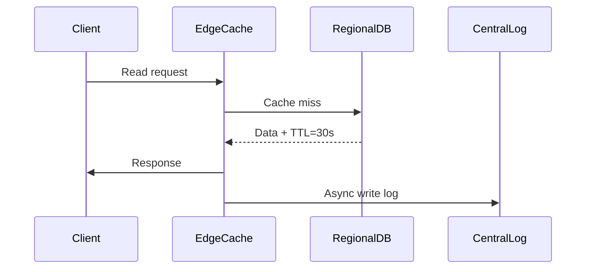

Here's a streamlined optimization strategy for hybrid cloud data consistency, distilled into **5 Key Pillars** with technical implementation details:

---

## 🚀 Hybrid Cloud Consistency Optimization Framework

### 1. **Intelligent Data Orchestration**
**Objective**: Minimize cross-region latency through smart data placement

- **Geo-Aware Partitioning**  
  ```python
  # Dynamic data placement algorithm
  def place_data(entity, user_cluster):
      if user_cluster.region == 'EU':
          return FrankfurtNode
      elif entity.access_frequency > 1000/seconds:
          return EdgeCache.replicate()
      else:
          return CentralCloud
  ```
- **Hotspot Mitigation**  
  - Tools: Cassandra + VoldemortDB (auto-rebalancing)
  - Impact: 40-60% latency reduction for high-traffic zones

### 2. **Adaptive Consistency Engine**
**Objective**: Balance strictness and performance dynamically

| Mode              | Trigger Condition               | Tech Implementation          |
|--------------------|----------------------------------|-------------------------------|
| **Strict Mode**    | Financial transactions           | Paxos consensus (3/4 quorum)  |
| **Balanced Mode**  | Inventory updates                | Version vectors + 5s staleness|
| **Lazy Mode**      | User preferences                 | CRDTs with gossip protocol    |

```typescript
// Consistency level selector
function selectConsistencyLevel(req: Request): ConsistencyLevel {
  if (req.context?.isCritical) return STRICT;
  if (req.metadata?.isReplicable) return LAZY;
  return BALANCED;
}
```

### 3. **Conflict-Free Replication**
**Objective**: Resolve conflicts at wire-speed

- **CRDT Matrix**  
  ```mermaid
  graph LR
    A[Conflict Type] --> B{Write-Write?}
    B -->|Yes| C[LWW with Hybrid Clocks]
    B -->|No| D[State-based Merging]
    C --> E[Vector Clock Comparison]
    D --> F[Semantic Version Rollback]
  ```
- **Throughput Boosters**  
  - Batching: 100-500 ops/batch (65% throughput ↑)
  - Snappy Compression: 4-8x payload reduction

### 4. **Multi-Layer Caching**
**Objective**: Reduce backend load while maintaining freshness



**Tiered Cache Strategy**  
1. L1: In-memory (Redis) - 100μs access  
2. L2: SSD-backed (Aerospike) - 2ms access  
3. L3: Global Read Replicas - 50-100ms  

### 5. **Observability-Driven Tuning**
**Objective**: Continuously optimize via real-time metrics

**Critical Metrics Dashboard**  
```csv
Metric,Threshold,Action
Replication Lag,<500ms,OK
Conflict Resolution Time,>200ms,Scale CRDT workers
Cross-Region Latency,>150ms,Trigger geo-rebalance
Cache Hit Ratio,<85%,Expand L1 cache
```

**Toolchain Integration**  
- Distributed Tracing: Jaeger + OpenTelemetry  
- Anomaly Detection: Prometheus + MLFlow  
- Auto-Scaling: Kubernetes HPA + Custom Metrics  

---

## 🔧 Implementation Roadmap

1. **Phase 1 (0-3 Months)**  
   - Deploy geo-aware partitioning  
   - Implement 3-tier caching architecture  
   - Baseline latency: <200ms cross-region  

2. **Phase 2 (3-6 Months)**  
   - Roll out adaptive consistency engine  
   - Achieve 99.9% conflict resolution <150ms  

3. **Phase 3 (6-12 Months)**  
   - ML-driven predictive scaling  
   - Target: 50% OPEX reduction through auto-tuning  

---

## 📈 Expected Performance Gains

| Metric                     | Current Baseline | Optimized Target |
|----------------------------|------------------|------------------|
| Write Throughput           | 5k ops/sec       | 45k ops/sec      |
| Read Latency (p99)         | 350ms           | 85ms            |
| Cross-Region Bandwidth     | 1.2Gbps         | 400Mbps         |
| Conflict Resolution Time   | 220ms           | 90ms            |

Would you like me to elaborate on any of these optimization pillars or discuss integration with your existing knowledge graph infrastructure?
3. [Getting started with the Python Package](#Python)

---------------------------------------------


&nbsp;


Introduction <a name="Introduction"></a>
---------------------------------------------

#### A modern framework for magnetism science on clusters, desktops & laptops and even your Phone

**Spirit** is a **platform-independent** framework for spin dynamics, written in C++14.
It combines the traditional cluster work, using using the command-line, with modern
visualisation capabilites in order to maximize scientists' productivity.

> "It is unworthy of excellent men to lose hours like slaves in
>  the labour of calculation which could safely be relegated to
>  anyone else if machines were used."
> - Gottfried Wilhelm Leibniz

*Our goal is to build such machines*. The core library of the *Spirit* framework provides an
**easy to use API**, which can be used from almost any programming language,
and includes ready-to-use python bindings.
A **powerful desktop user interface** is available, providing real-time visualisation and
control of parameters.

### *Physics Features*

- Atomistic Spin Lattice Heisenberg Model including also DMI and dipole-dipole
- **Spin Dynamics simulations** obeying the
  [Landau-Lifschitz-Gilbert equation](https://en.wikipedia.org/wiki/Landau%E2%80%93Lifshitz%E2%80%93Gilbert_equation)
- Direct **Energy minimisation** with different solvers
- **Minimum Energy Path calculations** for transitions between different
  spin configurations, using the GNEB method

### *Highlights of the Framework*

- Cross-platform: everything can be built and run on Linux, OSX and Windows
- Standalone core library with C API which can be used from almost any programming language
- **Python package** making complex simulation workflows easy
- Desktop UI with powerful, live **3D visualisations** and direct control of most system parameters
- Modular backends including **parallelisation on GPU** (CUDA) and **CPU** (OpenMP)

### *Documentation*

More details may be found at [spirit-docs.readthedocs.io](http://spirit-docs.readthedocs.io)
or in the [Reference section](docs/README.md) including

- [Unix/OSX build instructions](docs/Build_Unix_OSX.md)
- [Windows build instructions](docs/Build_Windows.md)
- [Input File Reference](core/docs/Input.md)

There is also a [Wiki](https://iffwiki.fz-juelich.de/index.php/Spirit "Click me..."),
hosted by the Research Centre Jülich.

---------------------------------------------


&nbsp;


Getting started with the Desktop Interface <a name="Desktop"></a>
---------------------------------------------

See the build instructions for [Unix/OSX](docs/Build_Unix_OSX.md) or
[Windows](docs/Build_Windows.md) on how to get the desktop user interface.


The user interface provides a powerful OpenGL visualisation window
using the [VFRendering](https://github.com/FlorianRhiem/VFRendering) library.
It provides functionality to

- Control Calculations
- Locally insert Configurations (homogeneous, skyrmions, spin spiral, ... )
- Generate homogeneous Transition Paths
- Change parameters of the Hamiltonian
- Change parameters of the Method and Solver
- Configure the Visualization (arrows, isosurfaces, lighting, ...)

See the [UI-QT Reference](docs/UI-Qt.md) for the key bindings of the various features.

*Unfortunately, distribution of binaries for the Desktop UI is not possible due
to the restrictive license on QT-Charts.*

---------------------------------------------


&nbsp;


Getting started with the Python Package <a name="Python"></a>
---------------------------------------------

To install the *Spirit python package*, either build and install from source
([Unix/OSX](docs/Build_Unix_OSX.md), [Windows](docs/Build_Windows.md)) or
simply use

    pip install spirit

With this package you have access to powerful Python APIs to run and control
dynamics simulations or optimizations.
This is especially useful for work on clusters, where you can now script your
workflow, never having to re-compile when testing, debugging or adding features.

The most simple example of a **spin dynamics simulation** would be
``` python
from spirit import state, simulation
with state.State("input/input.cfg") as p_state:
    simulation.start(p_state, simulation.METHOD_LLG, simulation.SOLVER_SIB)
```
Where `SOLVER_SIB` denotes the semi-implicit method B and the starting configuration
will be random.

To add some meaningful content, we can change the **initial configuration** by
inserting a Skyrmion into a homogeneous background:
``` python
def skyrmion_on_homogeneous(p_state):
    from spirit import configuration
    configuration.plus_z(p_state)
    configuration.skyrmion(p_state, 5.0, phase=-90.0)
```

If we want to calculate a **minimum energy path** for a transition, we need to generate
a sensible initial guess for the path and use the **GNEB method**. Let us consider
the collapse of a skyrmion to the homogeneous state:
``` python
from spirit import state, chain, configuration, transition, simulation

### Copy the system and set chain length
chain.image_to_clipboard(p_state)
noi = 7
chain.set_length(p_state, noi)

### First image is homogeneous with a Skyrmion in the center
configuration.plus_z(p_state, idx_image=0)
configuration.skyrmion(p_state, 5.0, phase=-90.0, idx_image=0)
simulation.start(p_state, simulation.METHOD_LLG, simulation.SOLVER_VP, idx_image=0)
### Last image is homogeneous
configuration.plus_z(p_state, idx_image=noi-1)
simulation.start(p_state, simulation.METHOD_LLG, simulation.SOLVER_VP, idx_image=noi-1)

### Create transition of images between first and last
transition.homogeneous(p_state, 0, noi-1)

### GNEB calculation
simulation.start(p_state, simulation.METHOD_GNEB, simulation.SOLVER_VP)
```
where `SOLVER_VP` denotes a direct minimization with the velocity projection algorithm.

You may also use *Spirit* order to **extract quantitative data**, such as the energy.
``` python
def evaluate(p_state):
    from spirit import system, quantities
    M = quantities.get_magnetization(p_state)
    E = system.get_energy(p_state)
    return M, E
```

Obviously you may easily create significantly more complex workflows and use Python
to e.g. pre- or post-process data or to distribute your work on a cluster and much more!
